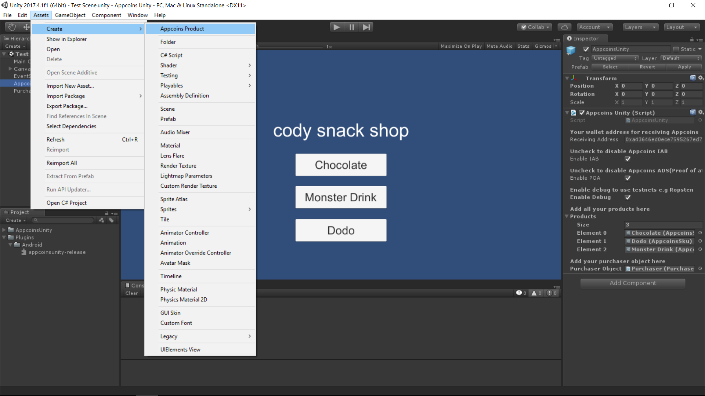
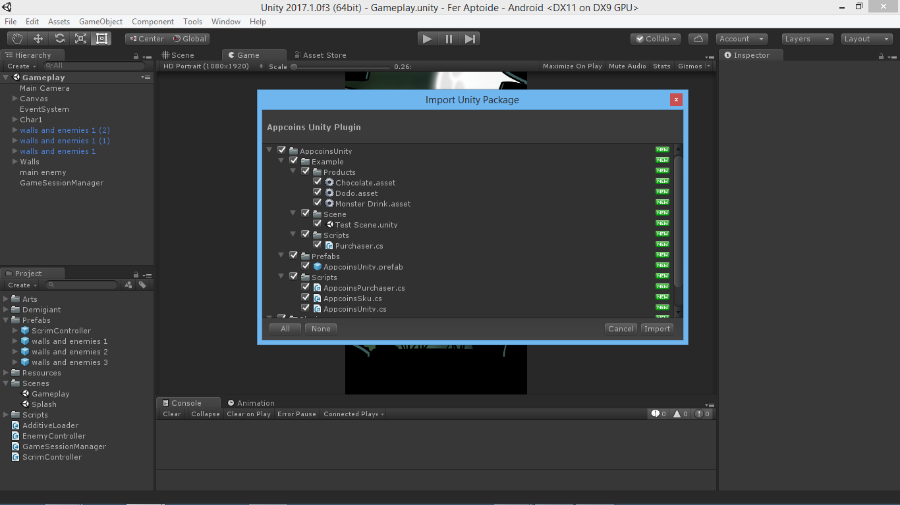
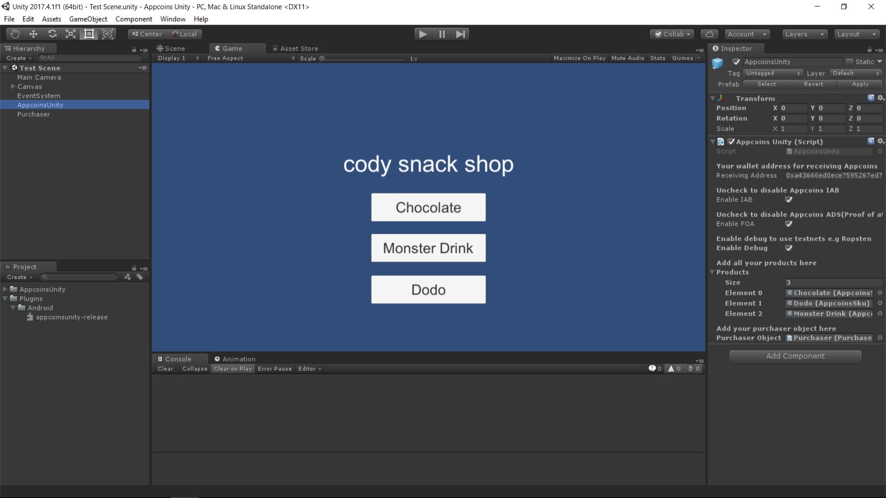
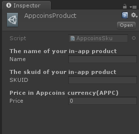
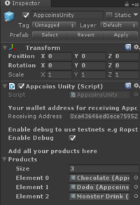
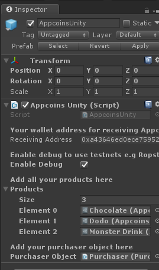

# Appcoins Unity Plugin

This is an unofficial unity plugin for Appcoins that allows you to integrate AppCoins in-app billing or Proof of Attention Ads into your unity android game.

## About Appcoins Unity Plugin
This plugin is developed from an excerpt of the Super Crossbar Challenge game. We thought it would be of great help if we can help other unity developers who would be integrating the Appcoins In-App Billing into their game save precious time by providing our solution as a plugin. Note that there is no restriction to what you can do with the plugin.

## Integrating plugin into your game
1. Download the plugin package "Appcoins Unity Plugin.unitypackage" file and open the package in your unity project, make sure to import everything in the unitypackage.

2. From the Assets/AppcoinsUnity/Prefabs folder drag and drop the AppcoinsUnity prefab into your scene or hierarchy window. 
Note:do not change the name of the AppcoinsUnity prefab.

3. In the inspector window where you have receiving address change the text to your appcoins wallet address where you would like to receive your appcoins.

4. check the enable debug checkbox If you would like to be able to use testnets like Ropsten for testing your Appcoins in-app billing integration.
Note: Uncheck this in production to avoid testnet purchases.

5. You need to create in-app products. 
To create an AppcoinsProduct click Assets/Create/Appcoins Product and fill in the product info. Create as many as your in app products.

6. Drag and drop all the product you created to the field on the AppcoinsUnity gameobject where you have products.
Note: in the image below i created and added 3 products Chocolate, Dodo and Monster Drink.

7. Create purchaser class in Unity C# by inheriting from the AppcoinsPurchaser Class:

...

//add this namespace to your script to give you  access to the plugin classes.
using Codeberg.AppcoinsUnity;

public class Purchaser : AppcoinsPurchaser {

//method gets called on successful purchases
	public override void purchaseSuccess (string skuid)
	{
		base.purchaseSuccess (skuid);
		//purchase is successful release the product
	}
//method gets called on failed purchases
	public override void purchaseFailure (string skuid)
	{
		base.purchaseFailure (skuid);
		//purchase failed perhaps show some error message

	}

	//example methods to initiate a purchase flow
    //the string parameter of the makePurchase method is the skuid you specified in the inspector for each product
	public void buyDodo(){
		makePurchase ("dodo");
	}

	public void buyMonster(){
		makePurchase ("monster");
	}

	public void buyChocolate(){
		makePurchase ("chocolate");
	}
}
...

8. Create an object in your scene and add the purchaser script you created to it. Drag and drop the purchaser object to the slot where you have the Purchaser Object on the AppcoinsUnity prefab you added to your scene earlier.

9. To build the project. The appcoins sdk which this plugin depends on is not compatible with unity's default build system or unity gradle but luckily unity allows us to export to android studio. Do not panic this is very simple. Goto your build settings in unity, change the build system to Gradle, check the export project checkbox and click export at the bottom of the build settings window.

10. After the project has finished exporting, we can import into Android Studio, open android studio and import project File/New/Import Project then locate the exported project folder. 
Note:Use Android Studio 3.0+ and set project min sdk in the android manifest file to 21

11. Open the project’s gradle script and add or change this lines 

Unity uses an older version of gradle so change to 3.0.0 or higher

...

buildscript {

dependencies {
  classpath 'com.android.tools.build:gradle:3.0.0'
}
}

allprojects {
  repositories {
     google()
     jcenter()
     maven { url "https://dl.bintray.com/asf/asf" }
     flatDir {
       dirs 'libs'
     }
  }
}

dependencies {
	compile fileTree(dir: 'libs', include: ['*.jar'])
	api 'com.asfoundation:appcoins:0.3.1a'
	compile(name: 'appcoinsunity-release', ext:'aar')
}

android {

  defaultConfig {
      multiDexEnabled true
    }
     dexOptions {
         javaMaxHeapSize "2g"
     }
   
    compileOptions {
       sourceCompatibility 1.8
       targetCompatibility 1.8
   }

}
...

12. Open the UnityPlayerActivity java class from the src folder and add or change the code below.

...

 @Override
    protected void onActivityResult(int requestCode, int resultCode, Intent data) {
        super.onActivityResult(requestCode, resultCode, data);
        UnityAppcoins.instance.onActivityResult(requestCode, resultCode, data);
}
...

13. Sync gradle project, Rebuild project and build APK.
