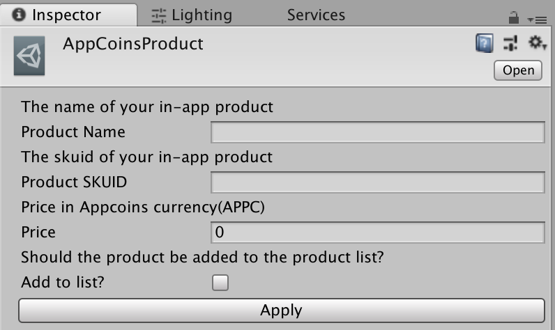
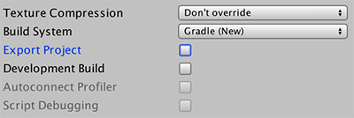
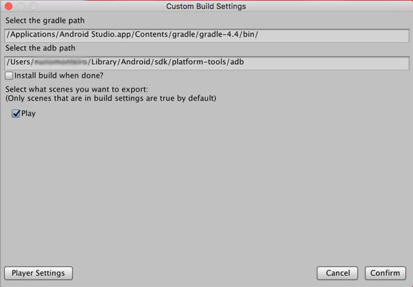
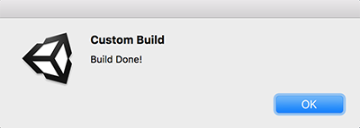
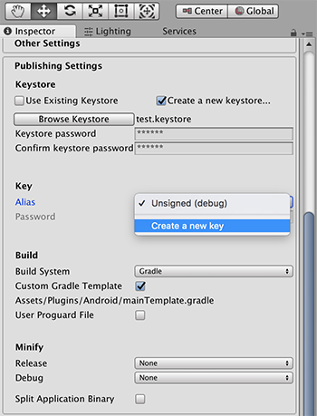
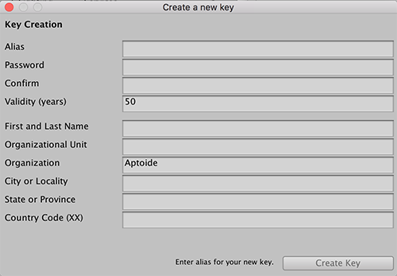
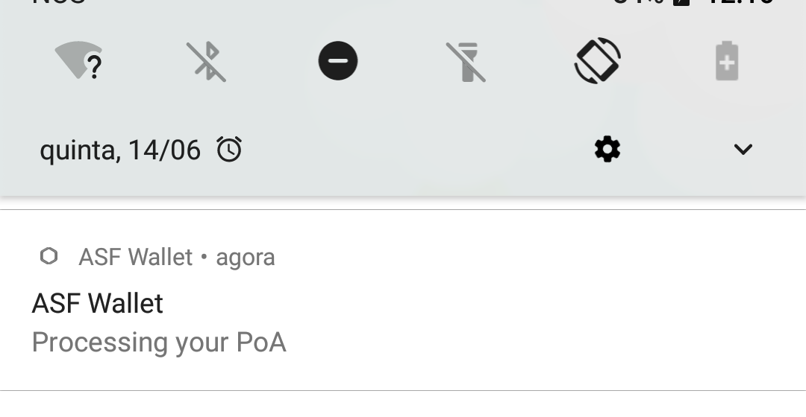

# AppCoins Unity Plugin


This is the official Unity plugin for the AppCoins Protocol that allows you to integrate AppCoins In-App Billing or Proof-of-Attention Ads into your Unity Android game.

## About AppCoins Unity Plugin
This plugin is developed from a fork of the unofficial unity plugin for AppCoins by [codeberg-io](https://github.com/codeberg-io/AppcoinsUnityPlugin).
 We thought it was a great initiative and decided to support the project and help all Unity developers who would be integrating the AppCoins In-App Billing into their game.

## Integrating the plugin into your game

1. Download the plugin package [AppCoins_Unity_Package.unitypackage](https://github.com/AppStoreFoundation/AppcoinsUnityPlugin/blob/develop/AppCoins_Unity_Package.unitypackage) file and open the package in your Unity project (double click the file or in Unity go to Assets -> Import Package -> Custom Package.... and find the file you just downloaded). If you don't want to import the example, make sure to untick the example folder. Everything else is mandatory.


2. From the Assets -> AppcoinsUnity -> Prefabs folder drag and drop the _AppcoinsUnity_ prefab into your scene or hierarchy window. **Note: do not change the name of the AppcoinsUnity prefab.**


3. In the inspector window where you have _Receiving Address_, change the text to your AppCoins wallet address where you would like to receive your AppCoins.

4. Check the _enable debug_ checkbox if you would like to be able to use testnets like Ropsten for testing your AppCoins In-App Billing integration.
**Note: Uncheck this in production to avoid testnet purchases.**

5. You need to create in-app products.
To create an _AppcoinsProduct_ click Assets -> Create -> Appcoins Product, fill in the product info and click Apply. Everytime you make a change to the product you should click Apply. This will create the product in a folder called "Products" inside the Assets folder. Create as many as your in-app products.



6. Drag and drop all the products you created to the field on the _AppcoinsUnity_ gameobject where you have products.

**Note: in the image below 3 products were created and added (Chocolate, Dodo and Monster Drink).**


**Note: Checking "Add to list" while creating the product will add the product to the products list automatically for you**

7. Create purchaser class in Unity C# by inheriting from the AppcoinsPurchaser Class:

```

//add this namespace to your script to give you  access to the plugin classes.
using Aptoide.AppcoinsUnity;

public class Purchaser : AppcoinsPurchaser {

	//method gets called on successful purchases
	public override void purchaseSuccess (string skuid)
	{
		base.purchaseSuccess (skuid);
		//purchase is successful release the product
	}

	//method gets called on failed purchases
	public override void purchaseFailure (string skuid)
	{
		base.purchaseFailure (skuid);
		//purchase failed perhaps show some error message

	}

	//example methods to initiate a purchase flow
	//the string parameter of the makePurchase method is the skuid you specified in the inspector for each product
	public void buyDodo(){
		makePurchase ("dodo");
	}

	public void buyMonster(){
		makePurchase ("monster");
	}

	public void buyChocolate(){
		makePurchase ("chocolate");
	}
}
```

8. Create an object in your scene and add the purchaser script you created to it. Drag and drop the purchaser object to the slot where you have the _Purchaser Object_ on the _AppcoinsUnity_ prefab you added to your scene earlier.


## To build the project


Go to the build menu (File -> Build Settings)
1. Check that the build system is set to "Gradle"
(if the import was done correctly this should've changed automatically).



Now click _Player Settings_.

On the _Player Settings_ window:
1. Click the other settings panel

2. Make sure you change the package name to your liking (if it was Unity's default one now it changed to com.aptoide.appcoins).

3. Make sure that you have min sdk version set to 21 (if the import was done correctly this should've changed automatically).

**Unity 2018.2b (and above)**

1. Connect the phone to your machine and click _Build and Run_

You should have your game running on the phone!

**Unity 2018.1.X and below (till Unity 5.X)**

1. Close the _Player Settings_ window

2. On the top bar click _Custom Build_

3. Click _Custom Android Build_

4. This popup will show up



5. The gradle path should be picked from the path to your Android Studio installation

6. The adb path will be picked by you (assuming you have Android SDK installed)

7. Pick the scenes you want to include. The ones added to the build settings will automatically be selected for you

8. When you click _Confirm_ a pop up will show up asking you to pick a folder to generate the _Android_ project to. Pick a folder of your liking preferably inside the project root (it can't be the project root itself).

**NOTE:** The final build will be located here:
  FolderYouChoseToBuildTo/ProjectName/build/outputs/apk/
  in a subfolder called debug or release, depending on build settings)

9. When you pick the folder the build process will start. The normal build process will happen and then the custom build process will kick in opening a terminal window. Unity might seem to be not responding but worry not! This is normal because it's waiting for the terminal processes to finish.

10. If you ticked _Install build when done?_ make sure you have your phone connected to the computer and that you unlock it to allow ADB to run



11. The build process completed. You can run the app on your phone!

**NOTE:** Although the process screenshots show MacOS this process was tested and successfully ran on Windows and Linux as well!

## To make a signed build
1. Go to Edit -> Project Settings -> Player

2. Open the Publishing Settings tab

If you already have a keystore:
3. Tick "Use Existing Keystore" and then click "Browse keystore" to fetch it.

4. You have to provide the keystore password to allow Unity to read the key aliases.

5. Pick the correct alias and provide it's password as well
 

6. You're done!

If you don't have a key already:
3. Tick "Create new keystore..." and then click "Browse Keystore"

4. Now pick the path where the key will be created

5. Now pick a password and write it again to confirm

6. Click the alias dropdown and then chose "Create a new key"


7. Fill in all the details and click "Create Key"


8. Now go back to the alias dropdown and pick the alias you just created

9. You're done!

## To run the project
To successfully run the project you need to:
1. Download and install ASF Wallet app (you can get it on [Aptoide](https://asf-wallet-app-store-foundation.en.aptoide.com/?store_name=asf-store) or [GooglePlay](https://play.google.com/store/apps/details?id=com.asfoundation.wallet))


2. Open ASF Wallet and create or restore a wallet
3. Launch the game

## To make sure integration is ok
**Testing POA**

If you enabled PoA, on the _AppCoinsUnity_ object, the expected flow for the app is to show you a notification saying that the PoA started



**Testing IAB**

To test your purchases, just follow the normal flow you do to trigger them. When they're triggered, this screen should show up:


-Make sure you test both the success and failure cases!

**Note: You can test the purchase flow right from the Editor to easily check both flows without having to build for the device**

Trying to make the purchase through the Editor should display a popup like this:


Pressing "Test success" will go through with the flow as if the purchase was successful (_purchaseSuccess_ on _Purchaser_ will be called).

Pressing "Test failure" will go through with the flow as if the purchase failed or was canceled (_purchaseFailed_ on _Purchaser_ will be called).

You're DONE! Congrats!
