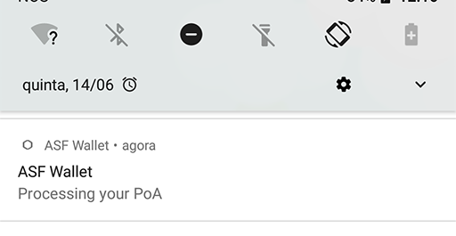
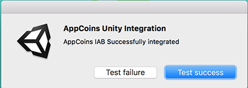

# AppCoins Unity Plugin


This is the official Unity plugin for the AppCoins Protocol that allows you to integrate AppCoins In-App Billing or Proof-of-Attention Ads into your Unity Android game.

## About AppCoins Unity Plugin
This plugin is developed from a fork of the unofficial unity plugin for AppCoins by [codeberg-io](https://github.com/codeberg-io/AppcoinsUnityPlugin).
 We thought it was a great initiative and decided to support the project and help all Unity developers who would be integrating the AppCoins In-App Billing into their game.

## Integrating the plugin into your game

1. Download the plugin package [AppCoins_Unity_Package.unitypackage](https://github.com/AppStoreFoundation/AppcoinsUnityPlugin/blob/develop/AppCoins_Unity_Package.unitypackage) file and open the package in your Unity project (double click the file or in Unity go to Assets -> Import Package -> Custom Package.... and find the file you just downloaded). If you don't want to import the example, make sure to untick the example folder. Everything else is mandatory.


2. From the Assets -> AppcoinsUnity -> Prefabs folder drag and drop the AppcoinsUnity prefab into your scene or hierarchy window. Previously this object had a dependency on its name... not anymore! You can rename it freely if you wish to!


3. In the inspector window where you have _Receiving Address_, change the text to your AppCoins wallet address where you would like to receive your AppCoins.

4. Check the enable debug checkbox if you would like to be able to use testnets like Ropsten for testing your AppCoins In-App Billing integration.
**Note: Uncheck this in production to avoid testnet purchases.**

5. You need to create in-app products.
To create an AppcoinsProduct, click Assets/Create/Appcoins Product and fill in the product info. Create as many as your in-app products.


6. Drag and drop all the products you've created to the field on the AppcoinsUnity gameobject where you have products.
**Note: in the image below I created and added 3 products Chocolate, Dodo and Monster Drink.**


7. Create purchaser class in Unity C# by inheriting from the AppcoinsPurchaser Class:

```

//add this namespace to your script to give you  access to the plugin classes.
using Codeberg.AppcoinsUnity;

public class Purchaser : AppcoinsPurchaser {

	//method gets called on successful purchases
	public override void purchaseSuccess (string skuid)
	{
		base.purchaseSuccess (skuid);
		//purchase is successful release the product
	}

	//method gets called on failed purchases
	public override void purchaseFailure (string skuid)
	{
		base.purchaseFailure (skuid);
		//purchase failed perhaps show some error message

	}

	//example methods to initiate a purchase flow
	//the string parameter of the makePurchase method is the skuid you specified in the inspector for each product
	public void buyDodo(){
		makePurchase ("dodo");
	}

	public void buyMonster(){
		makePurchase ("monster");
	}

	public void buyChocolate(){
		makePurchase ("chocolate");
	}
}
```

8. Create an object in your scene and add the purchaser script you created to it. Drag and drop the purchaser object to the slot where you have the Purchaser Object on the AppcoinsUnity prefab you added to your scene earlier.


## To build the project

**Unity 2018.2b (and above)**

Go to the build menu (File -> Build Settings) and click Player Settings.

On the Player Settings window:
1. Click the other settings panel

2. Make sure you change the package name to your liking (if it was Unity's default one now it changed to com.aptoide.appcoins).

3. Make sure that you have min sdk version set to 21 (if the import was done correctly this should've changed automatically).
4. Connect the phone to your machine and click "Build and Run"

You should have your game running on the phone!

**Unity 2018.1.X**

Coming soon!

**Unity 2017.X**

Coming soon!

**Unity 5.6.X**

Coming soon!

**Unity 5.5.X**

Coming soon!

## To run the project
To successfully run the project you need to:
1. Download and install ASF Wallet app (you can get it on [Aptoide](https://asf-wallet-app-store-foundation.en.aptoide.com/?store_name=asf-store) or [GooglePlay](https://play.google.com/store/apps/details?id=com.asfoundation.wallet))


2. Open ASF Wallet and create or restore a wallet
3. Launch the game

## To make sure integration is ok
**Testing POA**

If you enabled PoA, on the AppCoinsUnity object, the expected flow for the app is to show you a notification saying that the PoA started



**Testing IAB**

To test your purchases, just follow the normal flow you do to trigger them. When they're triggered, this screen should show up:


-Make sure you test both the success and failure cases!

**Note: You can test the purchase flow right from the Editor to easily check both flows without having to build for the device**

Trying to make the purchase through the Editor should display a popup like this:



Pressing "Test success" will go through with the flow as if the purchase was successful (purchaseSuccess on Purchaser will be called).

Pressing "Test failure" will go through with the flow as if the purchase failed or was canceled (purchaseFailed on Purchaser will be called).

You're DONE! Congrats!
